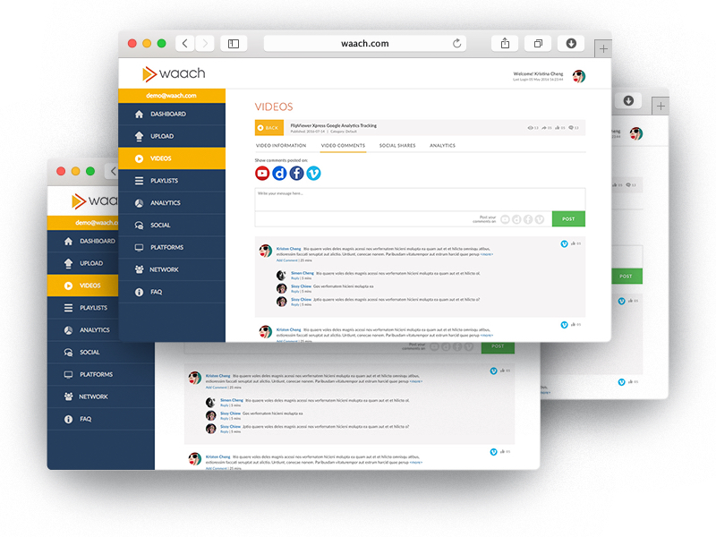

waach is an online video distribution platform that helps content creators from all around the world to meet a common objective: to have their videos watched by more people, across more destinations.
Basically, you can:
- Upload video to multi-platform (Youtube, Dailymotion, Vimeo, Facebook, etc) with simple click
- Migrate/transfer videos between platforms
- Analytics in 1 place
- SEO suggestion to get higher video search rank
- Embedded waach's widget to your website to get content relevant videos.

Role: Software Engineer

- Develop front-end with ReactJS, Redux
- Developer backend using Python Django
- Design and implement Cassandra database. Also, hand on PostgreSQL database.
- Design and implement message queue system with Celery and RabbitMQ
- Develope javascript third party library to embed in customer's website

